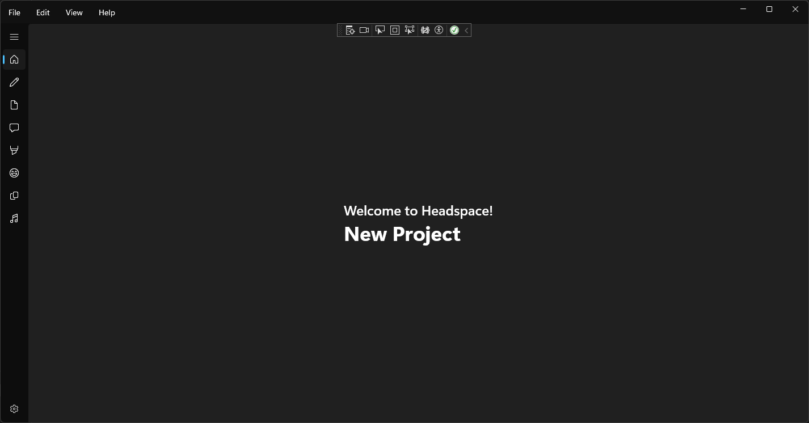
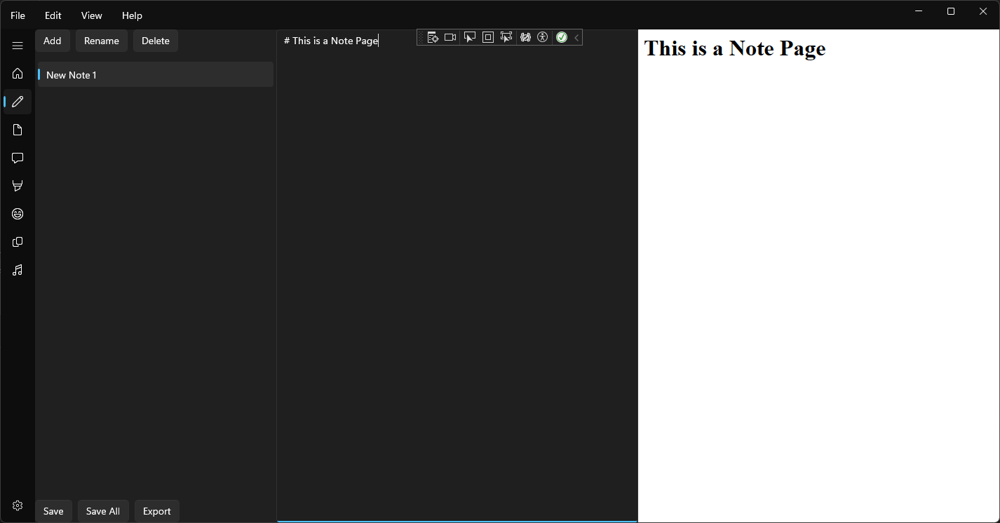
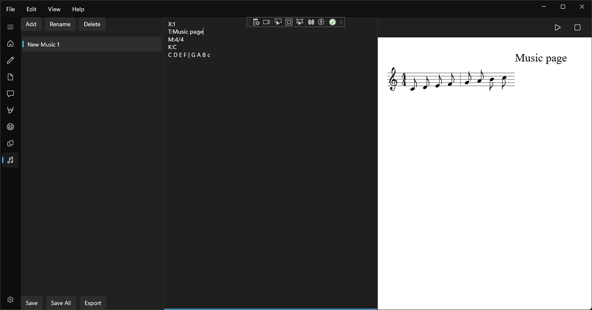

# Head Space

## Toolbox App for Ideas

This is a project for myself for storing and remembering ideas that might be used, put into one app.

# About this App

This app is made in C# with WinUI. I have been thinking about this for at least 3 months and may have taken around 400 hrs. for the first draft.

This app has been developed on my own. Since this app is my first official app to develop in C#, it has been a challenging yet fulfilling adventure. 

All of this stems from game development ideas, which is a multidimensional artform. Instead of branching ideas everywhere, this will put them in one box.

## Components
Home: An Overview for this app project

Notes: A Markdown note taking app for rough sticky notes level idea jotting

Documents: A Rich Text File based document for more complex files

Screenplay: Dialog/Scenes for Game Scenes or Short form Movies

Drawing: Simple MS Paint inspired drawing app for jotting down rough ideas in a visual way

Moodboard: A idea board maily for collages of various images

Storyboard: Art Direction for visual story direction

Music: Music Sheet for musical ideas

# Future
- General 
	- Save/Load
	- More Shortcuts
	- Increase menubar style
	- Tags for individual items
	- Export for each component to appropriate format

- Home
	- Make it an overview or each page

- Notes
	- (Maybe) Add Syntax Highlighting
	
- Documents
	- Word like toolbar
	- Adjustable Document size
	- Variable font size
	- Adjustablel Font color

- Screenplay
	- Change screenplay to font ratio (right now its too small)
	- tab/enter to move between modes(e.g. Dialog, Character, Explanation)
	- adjustable script size
	- Indicator (on top corner) to change the type of section

- Drawing
	- Image pasting
	- Resizable canvas
	- Toolbar

- Moodboard
	- Image pasting
	- Resizable canvas
	- Toolbar

- Storyboard
	- Image pasting
	- Resizable canvas
	- Storyboard squares
	- Toolbar

- Music
	- Apply Changes on text edit
	- Play the notes with simple sound MIDI
	- Toolbar to help how to write

- Preference
	- Style
	- default name
	- default save location
	