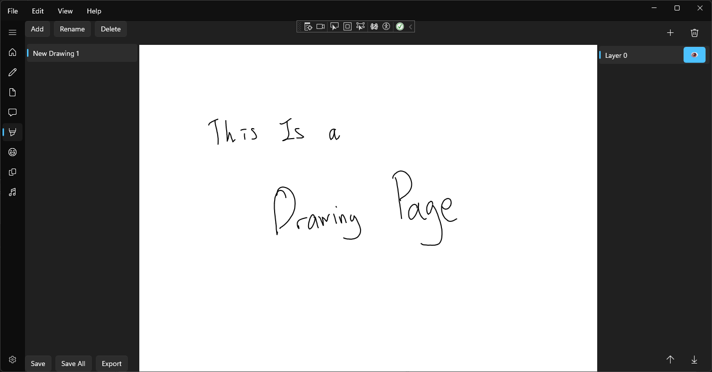

# Head Space

## Toolbox App for Ideas

This is a project for myself for storing and remembering ideas that might be used, put into one app.

## Components
Notes: A Markdown note taking app for rough sticky notes level idea jotting

Documents: A Rich Text File based document for more complex files

Screenplay: Dialog/Scenes for Game Scenes or Short form Movies

Drawing: Simple MS Paint inspired drawing app for jotting down rough ideas in a visual way

Moodboard: A idea board maily for collages of various images

Storyboard: Art Direction for visual story direction

# Future
- General 
	- Save/Load
	- Shortcuts
	- Increase menubar style
	- Tags for individual items

- Notes
	- (Maybe) Add Syntax Highlighting
	
- Documents
	- Word like toolbar
	- Adjustable Document size
	- Varyable font size

- Screenplay
	- tab/enter to move between modes(e.g. Dialog, Character, Explanation)

- Drawing
	- Image pasting
	- Resizable
	- Layers

- Moodboard
	- Image pasting
	- Resizable

- Storyboard
	- Image pasting
	- Resizable
	- Storyboard squares
	- Multiple pages (maybe timeline on bottom)

# About this App

This app is made in C# with WinUI. I have been thinking about this for at least 3 months and may have taken around 400 hrs. for the first draft.

This app has been developed on my own. Since this app is my first official app to develop in C#, it has been a challenging yet fulfilling adventure. 

All of this stems from game development ideas, which is a multidimensional artform. Instead of branching ideas everywhere, this will put them in one box.