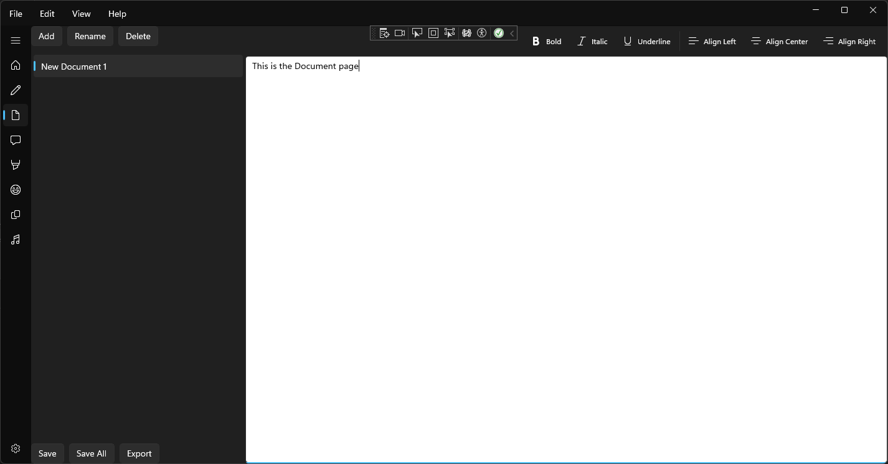
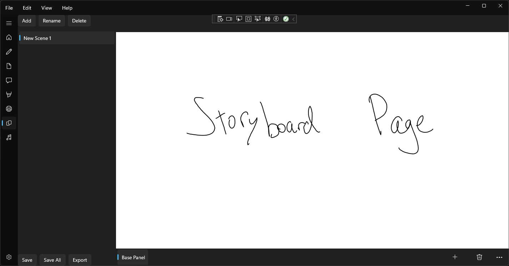

# Head Space

## アイデアのツールボックス

このプロジェクトは私がゲームなどのアイデアをまとめるために作りました。
様々なジャンルのアイデア（メモ、登場人物、ストーリー）を一つのアプリにし、考えをまとめられるようにしています。

## 構成要素
メモ: マークダウン形式でメモやアイデアのまとめを行う

ドキュメント: RTF形式で文書を作成する

脚本: 脚本風に人物のダイアログなどを書くためのページ

絵: スケッチや言葉で表しづらいものを描く

ムードボード: 人物や風景のアイデアをコラージュ形式で表現する

絵コンテ: 物語の進行などをまとめる

# 今後の予定
- 全般 
	- セーブ／ロード
	- ショートカットの導入
	- メニューバーの充実化
	- アイテムごとのタグ

- メモ
	- （可能なら）シンタックスハイライト

	
- ドキュメント
	- Word風のツールバー
	- ドキュメントのサイズの変更化
	- フォントのサイズ変更

- 脚本
	- タグ付けの簡易化

- 絵
	- 画像貼り付け
	- サイズ変更
	- レイヤー

- ムードボード
	- 画像貼り付け
	- サイズ変更

- 絵コンテ
	- 画像貼り付け
	- サイズ変更
	- 絵コンテの四角
	- 1つのアイテムに複数ページ

# このアプリについて

このアプリはC#とWinUIを用いて作りました。このアプリは約3か月前か構想を始め、約400時間かかりました。

このアプリは私単独で行いました。初めてC#での開発だったため、わからないことも多く、かつ同時にとても身になる体験にもなりました。